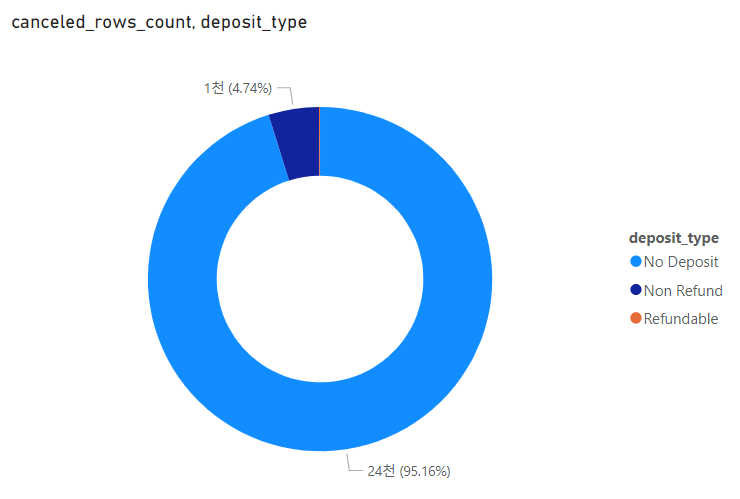

# **ANSI-SQL와 Power BI를 활용한 호텔 예약 데이터 분석 및 시각화** 


## **Overview**

본 프로젝트는 ANSI-SQL query를 사용하여 연도별 호텔 예약 데이터와 meal cost 및 market segment관련 테이블을 하나의 테이블로 JOIN하여 주어진 호텔의 수익 dataset 분석 및 Power BI를 사용하여 시각화합니다.

시각화된 결과는 호텔의 지분을 가지고 있는 주주들에게 현재 호텔의 운영 상태에 대해 설명을 할 때 중요한 자료가 되며, 더 나아가 앞으로 호텔을 운영함에 있어 의사결정을 하는데 중요한 지표로써 활용됩니다. 

<br/>

## **Dataset**

본 프로젝트에서 사용할 데이터는 Kaggle에서 제공하는 `Hotel booking demand` 데이터셋을 활용했습니다. 해당 데이터셋을 선택한 이유는 직접 호텔 운영을 담당하는 직원의 입장이 되어, 호텔의 성장에 대해서 주주들에게 직접 데이터를 기반으로 설명을 하고, 앞으로의 운영 방향에 대해서도 설명을 한다면, 좋은 데이터 분석 연습이 될 것 같아 정하게 되었습니다.

`[Hotel booking demand(Kaggle)]` : https://www.kaggle.com/datasets/jessemostipak/hotel-booking-demand

<br/>

## **Architecture**

전체적인 아키텍처는 Kaggle에서 다운받은 dataset(excel 파일)을 MS SQL에 import하고, SSMS에서 query작성을 통해 분석을 합니다. 
분석을 한 후에는 종합적으로 JOIN한 테이블을 Power BI 툴에 import하여 대시보드를 구성하여, 주주들이 시각적으로 현재 호텔의 운영 상태에 대해서 볼 수 있도록 할 것입니다.


<br/>

## **Requirements**

### **[가정]** 

현재 두 호텔을 운영하고 있습니다. 호텔의 수익 데이터를 대시보드로 시각화하고 데이터 기반으로 분석하여, 주주들에게 호텔이 매년 성장을 하고 있음을 설명해야 합니다. 

### **Q1.** <ins>호텔의 수익이 매년 성장하고 있는가?</ins>

두 호텔을 소유하고 있기 때문에 수익을 호텔별로 구분하여 시각화 하는 것이 좋을 것 같습니다.

`데이터 기반 분석` : 두 호텔의 수익을 종합적으로 살펴보면, 평균 adr과 숙박 일수가 꾸준히 증가하고 있음을 알 수 있으며, 각 호텔의 수익률 변화를 살펴보면 전체적으로 성장하고 있음을 알 수 있었습니다.    

### **Q2.** <ins>호텔의 주차장 사이즈를 넓혀야 하는가?</ins>

이용하는 고객들이 개인적으로 차를 가지고 오는 경향이 있는지에 대한 분석이 필요합니다.

`데이터 기반 분석` : 결정을 위한 충분한 근거 자료가 있지 않지만, Resort hotel은 3%의 사용자가 주차장을 이용하고 있으며, 상대적으로 City hotel의 숙박객은 주자장을 적게 사용하고 있음을 알 수 있습니다. (`0.88~1.29%`) 따라서 호텔의 주차장을 확장해야 될 필요성은 없는 것으로 파악하였습니다. 

### **Q3.** <ins>주어진 데이터에서 어떠한 경향을 관찰할 수 있는가?</ins>

일일 평균 요금과 투숙객에 초점을 맞추어 계절적 변동을 탐색해보면, 7월 중순에서 9월 말 사이에 가장 많은 숙박객이 호텔을 방문하고 있음을 알 수 있었습니다. 할인율 또한 숙박객들이 많이 방문하는 기간에 높은 것을 알 수 있었습니다.

### **Q4.** <ins>호텔 종류와 예약 취소와의 상관 관계는 어떻게 되는가?</ins>

City hotel은 전체 예약 건수 대비 29.13%의 예약 취소율을 가지며, Resort hotel의 경우, 22.82%의 예약 취소율을 가지고 있음을 확인할 수 있었습니다. 두 호텔을 종합적으로 보았을때 예약 취소의 경우에는 25.37%의 비중을 차지하고, 예약 확약의 경우에는 73.47%를 차지하고 있음을 확인할 수 있었습니다.

### **Q5.** <ins>호텔 숙박시, 식사 예약 비율은 어떻게 되는가?</ins>

No show 및 Cancel한 사용자를 제외한 숙박객 중 0.62%(Undefined)를 제외한 99.38%의 투숙객이 식사를 예약하고 있음을 확인할 수 있었습니다. 그 중에서 BB(Bed & Breakfast)가 79.22%로 가장 많은 식사 예약 타입이었으며, 그 다음으로 아침과 저녁 식사를 포함한 HB가    


### **Q6.** <ins>호텔에 가장 많이 방문하는 고객의 국가는 어떻게 되는가?</ins>

### **Q7.** <ins>가장 많이 예약을 하는 세그먼트와 가장 많이 예약을 취소하는 세그먼트는 어떻게 되는가?</ins>

### **Q8.** <ins>보증금과 예약 취소와의 관계는 어떻게 되는가?</ins>

<br/>

## **Visualization**

ANSI-SQL query를 활용하여 데이터를 분석하고, Requirements 카테고리에 있는 Q1~Q8 항목에 대해서 Power BI를 활용해서 시각화를 합니다.   

<table>
    <tr>
        <th style="text-align:center">NO</th>
        <th style="text-align:center">Image</th>
        <th style="text-align:center">Description</th>
    </tr>
    <tr>
        <td>1</td>
        <td>
            
        </td>
        <td>
            <b>[가장 많이 방문한 방문객의 국가]</b>
            <br/>
            <small>가장 많이 방문한 방문객의 국가는 포루투갈(PRT)로, 29.52%를 차지했으며, 그 다음으로 영국(GBR)이 12.91%로 많았고, 세 번째로 많이 방문한 방문객의 국가는 프랑스(FRA)로 10.9%를 차지했다.</small>
        </td>
    </tr>
    <tr>
        <td>5</td>
        <td>
            
        </td>
        <td>
            <b>[가장 많이 예약하는 세그먼트]</b>
            <br/>
            <small>예약한 고객들 중 가장 많은 예약 수단은 Online TA로, 50.88%를 차지하고 있으며, 그 다음으로 Offline TA/TO가 19.59%로 두 번째로 많은 비중을 차지했습니다. 세 번째로는 Direct로 직접 예약을 하는 케이스로 16.09%를 차지하고 있습니다.</small>
        </td>
    </tr>
    <tr>
        <td>3</td>
        <td>
            
        </td>
        <td>
            <b>[호텔 숙박시, 식사 예약 비율]</b>
            <br/>
            <small>No show와 Canceled를 제외한 0.62%(Undefined)을 제외한 예약 고객이 전부 식사 예약을 하였으며, 그 중에서 BB가 79.22%로 가장 많은 식사 예약 타입이었으며, 그 다음으로 HB가 10.91%로 뒤를 이었다.</small>
        </td>
    </tr>
    <tr>
        <td>1</td>
        <td>
            
            
        </td>
        <td>
            <b>[호텔의 종류와 예약 취소와의 상관 관계]</b><br/>
            <small>City hotel의 경우에는 전체 예약 건수의 29.13%가 취소 건수로 집계되고 있으며, Resort hotel의 경우에는 전체 예약 건수의 22.82%가 예약 취소 건수로 집계되고 있다.</small>     
        </td>
    </tr>
    <tr>
        <td>2</td>
        <td>
            
        </td>
        <td>
            <b>[주중과 주말 숙박 일수]</b>
            <br/>
            <small>총 예약된 숙박 일수를 분석해보면, 전체 숙박의 72.35%가 주중 숙박으로 집계가 되고 있다. (주말 숙박은 27.65%)</small>
        </td>
    </tr>
    <tr>
        <td>6</td>
        <td>
            
        </td>
        <td>
            <b>[가장 많이 예약을 취소하는 세그먼트]</b>
            <br/>
            <small>가장 많이 예약을 취소하는 예약 수단은 Online TA로 74.73%를 차지하고 있으며, 그 다음으로 9.07%인 Offline TA/TO, Direct가 7.09%로 뒤를 이었습니다.</small>
        </td>
    </tr>
    </tr>
        <tr>
        <td>7</td>
        <td>
            
        </td>
        <td>
            <b>[보증금과 예약 취소와의 관계]</b>
            <br/>
            <small>예약 취소 건수 중 95.16%가 보증금이 없는 경우이며, 4.74%가 환불이 불가능함에도 취소를 하였고, 환불이 가능한 상태에서 예약 취소를 한 25건(0.1%)이 가장 작은 비율을 차지했다.</small>
        </td>
    </tr>
</table>

<br/>


<div style="display:flex; justify-content:center">
    
</div>

<br/>

## **Data Analysis Project Pipeline**

#### **STEP1)** Database 구축하기
(1) **SQL Server** : Microsoft SQL Server Express <br/>
(2) **SSMS** : SQL Server Management Studio v18.12.1 <br/>
(3) **Dataset** : dataset/hotel_revenue_historical_full.xlsx

#### **STEP2)** SQL query 작성하기
`data-analysis/hotel-reservation-data-analysis.sql` 파일 내 query 작성하였습니다.

#### **STEP3)** Power BI를 Database에 연결하기

Power BI Desktop에서 MS SQL Server의 Database로부터 데이터를 import하였습니다.

#### **STEP4)** 시각화 하기

데이터를 본격적으로 시각화하기 전에 예약 방식에 따라 할인이 다르게 적용되기 때문에 별도로 수익에 대한 revenue column을 Power query 편집기를 활용(데이터 변환)하여 추가해주도록 한다. 그리고 가장 중요한 시각화 자료는 최 상단에 배치를 하도록 한다. 

#### **STEP5)** 결과 요약하기

<br/>

## Prerequisites

- SQL Server 및 SQL Server Management Studio 설치 

    `(1) SQL Server Engine` : https://www.microsoft.com/en-us/sql-server/sql-server-downloads

    `(2) SQL Server Management Studio` : https://docs.microsoft.com/en-us/sql/ssms/download-sql-server-management-studio-ssms?view=sql-server-ver16
- Power BI Desktop 설치
- 코드를 실행할 IDE (VSCODE, Sublime Text 등) 설치

<br/>

## How to Run This Project

1. SSMS에서 설치한 SQL Server 이름을 입력하여 연결 
2. Database - [New Database...] 선택 - 데이터베이스 추가
3. 추가된 데이터베이스 우측 클릭 - [Import Data...] - Microsoft Excel(Data source) 선택 
4. `dataset/hotel_revenue_historical_full.xlsx` / Microsoft Excel 2016 버전 선택
5. Destination으로 `SQL Server Native Client 11.0` 및 Database로 추가한 Database 선택
6. Power BI Desktop 앱을 열고 데이터 소스로 `SQL Server`를 클릭해서 데이터베이스를 import한다. (`고급 옵션에서 아래의 SQL문을 입력한다`)

    ```sql
    WITH hotels AS (
    SELECT * FROM dbo.['2018$']
    UNION
    SELECT * FROM dbo.['2019$']
    UNION
    SELECT * FROM dbo.['2020$'])

    SELECT * FROM hotels
    LEFT JOIN dbo.market_segment$
    ON hotels.market_segment = market_segment$.market_segment
    LEFT JOIN dbo.meal_cost$
    ON meal_cost$.meal = hotels.meal
    ```
7. Power BI Desktop 앱에서 입력한 데이터를 활용해서 그래프로 시각화를 한다. (`power_bi/hotel_reservation_dataset_analysis.pbix`)

## Lessons Learned

이번 프로젝트를 통해 MS SQL SSMS에서 SQL query 작성 연습도 해보고, Power BI로 데이터를 시각화해서 대시보드를 직접 만들어보는 유익한 시간이었습니다. <br/>

가상으로 호텔을 운영한다는 전제로 데이터를 분석해보니 어떤식으로 대시보드를 구성해서 호텔의 지분을 가지고 있는 주주들에게 보여줘야 될지, 그리고 현재 호텔을 운영함에 있어 어떠한 문제가 있고, 개선을 해야 되는지에 대해서 데이터를 통해 파악을 할 수 있다는 점이 흥미로웠던 것 같습니다. <br/>


