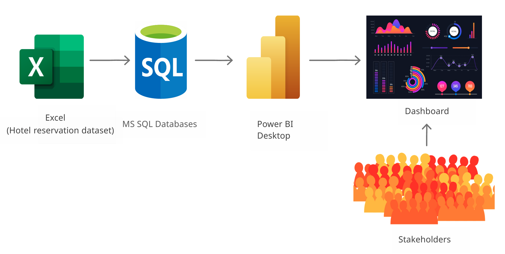

# **ANSI-SQL와 Power BI를 활용한 호텔 예약 데이터 분석 및 시각화** 

## **Overview**

본 프로젝트는 ANSI-SQL query를 사용하여 주어진 호텔의 수익 dataset을 분석하고, Power BI를 사용하여 시각화합니다. 시각화된 결과는 호텔의 지분을 가지고 있는 주주들에게 현재 호텔의 운영 상태에 대해 설명을 할 때 중요한 자료가 되며, 더 나아가 앞으로 호텔을 운영함에 있어 의사결정을 하는데 중요한 지표로써 활용됩니다. 

## **Dataset**

본 프로젝트에서 사용할 데이터는 Kaggle에서 제공하는 `Hotel booking demand` 데이터셋을 활용했습니다. 해당 데이터셋을 선택한 이유는 직접 호텔 운영을 담당하는 직원의 입장이 되어, 호텔의 성장에 대해서 주주들에게 직접 데이터를 기반으로 설명을 하고, 앞으로의 운영 방향에 대해서도 설명을 한다면, 좋은 데이터 분석 연습이 될 것 같아 정하게 되었습니다. 

## **Architecture**

## **Visualization**

ANSI-SQL query를 활용하여 데이터를 가공하고, Requirements 카테고리에 있는 Q1~Q3 항목에 대해서 Power BI를 활용해서 시각화를 합니다.  

Q4~Q7 항목도 추가하여, 아래 대시보드의 구성을 좀 더 다채롭게 구성해보는 것도 좋을 것 같다. 우선 여지까지 추가된 내용에 대해 시각화한 대시보드는 임시로 추가해두고, 차후에 대시보드를 수정하게 되면, 정기적으로 수정해서 업데이트하도록 하자.

<table>
    <tr>
        <th style="text-align:center">NO</th>
        <th style="text-align:center">Image</th>
        <th style="text-align:center">Description</th>
    </tr>
    <tr>
        <td>1</td>
        <td>
            
        </td>
        <td>
            <b></b> 
            <small></small>     
        </td>
    </tr>
    <tr>
        <td>2</td>
        <td>
            
        </td>
        <td>
        <b></b>
             
            <small></small>
        </td>
    </tr>
    <tr>
        <td>3</td>
        <td>
            
        </td>
        <td>
            <b></b>
             
            <small></small>
        </td>
    </tr>
    <tr>
        <td>4</td>
        <td>
            
        </td>
        <td>
            <b></b>
             
            <small></small>
        </td>
    </tr>
</table>

 

## **Requirements**

가정 : 현재 두 호텔을 운영하고 있습니다. 호텔의 수익 데이터를 대시보드로 시각화하고 데이터 기반으로 분석하여, 주주들에게 호텔이 매년 성장을 하고 있는지에 대해 설명하여야 합니다. 

#### **Q1.** <ins>호텔의 수익이 매년 성장하고 있는가?</ins>

두 타입의 호텔을 소유하고 있기 때문에 수익을 호텔 타입별로 구분하는 것이 좋습니다.

#### **Q2.** <ins>호텔의 주차장 사이즈를 넓혀야 하는가?</ins>

이용하는 고객들이 개인적으로 차를 가지고 오는 경향이 있는지에 대한 분석이 필요합니다.

결정을 위한 충분한 근거 자료가 있지 않지만, Resort hotel은 3%의 사용자가 주차장을 이용하고 있으며, 상대적으로 City hotel의 숙박객은 주자장을 적게 사용하고 있음을 알 수 있습니다. (`0.88~1.29%`)  

#### **Q3.** <ins>주어진 데이터에서 어떠한 경향을 관찰할 수 있는가?</ins>

일일 평균 요금과 투숙객에 초점을 맞추어 계절적 변동을 탐색합니다.

#### **Q4.** <ins>호텔 종류와 예약 취소와의 상관 관계는 어떻게 되는가?</ins>

#### **Q5.** <ins>호텔에 가장 많이 숙박하는 일 수는?</ins>

#### **Q6.** <ins>호텔 숙박시, 식사 예약 비율은 어떻게 되는가?</ins>

#### **Q7.** <ins>호텔에 가장 많이 방문하는 고객의 국가와 가장 많이 취소하는 고객의 국가는 어떻게 되는가?</ins>

#### **Q8.** <ins>가장 많이 예약을 하는 세그먼트와 가장 많이 예약을 취소하는 세그먼트는 어떻게 되는가?</ins>

#### **Q9.** <ins>예약한 객실과 배정된 객실은 동일한가?</ins>

#### **10.** <ins>보증금과 예약 취소와의 관계는 어떻게 되는가?</ins>

 

## **Data Analysis Project Pipeline**

#### **STEP1)** Database 구축하기
(1) **SQL Server** : Microsoft SQL Server Express  
(2) **SSMS** : SQL Server Management Studio v18.12.1  
(3) **Dataset** : dataset/hotel_revenue_historical_full.xlsx

#### **STEP2)** SQL query 작성하기
`data-analysis/hotel-reservation-data-analysis.sql` 파일 내 query 작성하였습니다.

#### **STEP3)** Power BI를 Database에 연결하기

Power BI Desktop에서 MS SQL Server의 Database로부터 데이터를 import하였습니다.

#### **STEP4)** 시각화 하기

데이터를 본격적으로 시각화하기 전에 예약 방식에 따라 할인이 다르게 적용되기 때문에 별도로 수익에 대한 revenue column을 Power query 편집기를 활용(데이터 변환)하여 추가해주도록 한다. 그리고 가장 중요한 시각화 자료는 최 상단에 배치를 하도록 한다. 

#### **STEP5)** 결과 요약하기

 

## Prerequisites

- SQL Server 및 SQL Server Management Studio 설치 

    `(1) SQL Server Engine` : https://www.microsoft.com/en-us/sql-server/sql-server-downloads

    `(2) SQL Server Management Studio` : https://docs.microsoft.com/en-us/sql/ssms/download-sql-server-management-studio-ssms?view=sql-server-ver16
- Power BI Desktop 설치
- 코드를 실행할 IDE (VSCODE, Sublime Text 등) 설치

 

## How to Run This Project

1. SSMS에서 설치한 SQL Server 이름을 입력하여 연결 
2. Database - [New Database...] 선택 - 데이터베이스 추가
3. 추가된 데이터베이스 우측 클릭 - [Import Data...] - Microsoft Excel(Data source) 선택 
4. `dataset/hotel_revenue_historical_full.xlsx` / Microsoft Excel 2016 버전 선택
5. Destination으로 `SQL Server Native Client 11.0` 및 Database로 추가한 Database 선택

## Lessons Learned

이번 프로젝트를 통해 MS SQL SSMS에서 SQL query 작성 연습도 해보고, Power BI로 데이터를 시각화해서 대시보드를 직접 만들어보는 유익한 시간이었습니다.  

가상으로 호텔을 운영한다는 전제로 데이터를 분석해보니 어떤식으로 대시보드를 구성해서 호텔의 지분을 가지고 있는 주주들에게 보여줘야 될지, 그리고 현재 호텔을 운영함에 있어 어떠한 문제가 있고, 개선을 해야 되는지에 대해서 데이터를 통해 파악을 할 수 있다는 점이 흥미로웠던 것 같습니다.  

